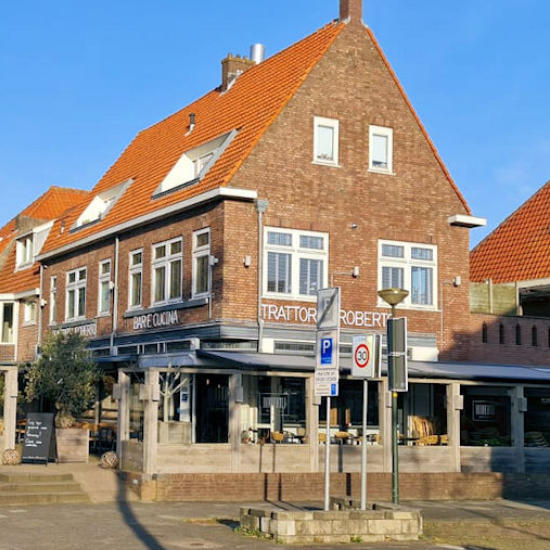

Voor de eerste tent van _Tour de la Schrans_ gingen we naar [Restaurant Roberto](https://roberto-alkmaar.nl/). Een Italiaans restaurant in Alkmaar, en bekend om hun beste _**pizza van Europa!**_

<!-- truncate -->

We hadden meerdere gerechten besteld en gedeeld. We begonnen met de Bruschetta, wat een heerlijke starter was. Daarna had ik een Pizza margherita, wat een lekkere steenoven pizza was. En daarnaast had ik wat frietjes en salade gepakt van de tafel.

Ze hadden ook een stoofpeer walnoten pizza. Volgens Marthijn is die heerlijk, maar het leek ons allemaal zo smerig dat we het niet hebben geprobeerd. 

Al in al was het heerlijk eten, en vriendelijk personeel. We hebben zelfs de man hemzelf, Roberto, gezien maar ik durfde helaas niet om een foto te vragen.

## Cijfers

| Persoon  | Cijfer |
|----------|--------|
| Marthijn | 8,3    |
| Bas      | 9,1    |
| Madelief | 7,0    |
| Jordy    | 10     |
|**Totaal**|**8,9** |

## Locatie

<iframe src="https://www.google.com/maps/embed?pb=!1m18!1m12!1m3!1d2422.0190350890566!2d4.734338977020612!3d52.623500128561105!2m3!1f0!2f0!3f0!3m2!1i1024!2i768!4f13.1!3m3!1m2!1s0x47cf572c564c2bdb%3A0xe19e91f2fbae5e43!2sRoberto%20bar%20e%20cucina!5e0!3m2!1snl!2snl!4v1727826688913!5m2!1snl!2snl" width="600" height="450" allowfullscreen="" loading="lazy" referrerpolicy="no-referrer-when-downgrade"></iframe>
