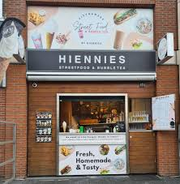
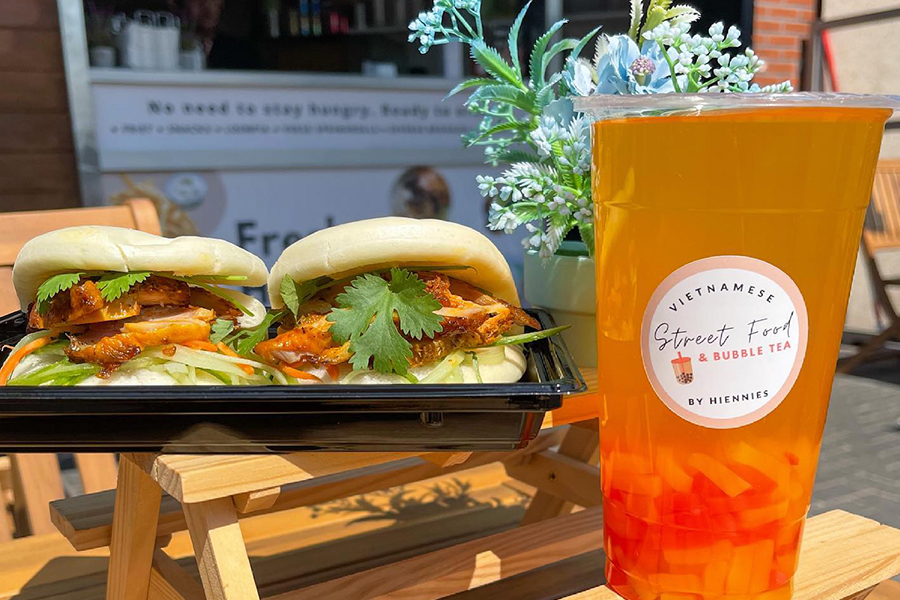

Vandaag gingen we naar [Hiennies](https://hiennies.sitedish.shop/). Een streetfood tent in Heerhugowaard. Volgens vele hebben ze het _**beste streetfood van Europa!**_

<!-- truncate -->

Ze hebben een groot menu met niet alleen streetfood, maar ook snackbar gerechten. Zelf had ik een broodje hete kip met een kaassoufflé. De hete kip was best lekker, maar net iets te pittig voor mij. De kaassoufflé was _very nice_.

Het personeel was vriendelijk, maar het duurde wel effe voordat we ons eten kregen. Maar misschien voelt het alleen maar zo omdat we staand in de kou moesten wachten.

## Cijfers

| Persoon  | Cijfer |
|----------|--------|
| Marthijn | 8,7    |
| Bas      | 6,9    |
| Jordy    | 10     |
|**Totaal**|**8,5** |

## Locatie

<iframe src="https://www.google.com/maps/embed?pb=!1m18!1m12!1m3!1d2419.8720095748195!2d4.82603599363711!3d52.662289353750715!2m3!1f0!2f0!3f0!3m2!1i1024!2i768!4f13.1!3m3!1m2!1s0x47cf543b90877ae3%3A0xd7088eb721d02d5b!2sStreetfood%20By%20Hiennies%20%26%20Bubble%20Tea!5e0!3m2!1snl!2snl!4v1727829332715!5m2!1snl!2snl" width="600" height="450" allowfullscreen="" loading="lazy" referrerpolicy="no-referrer-when-downgrade"></iframe>
