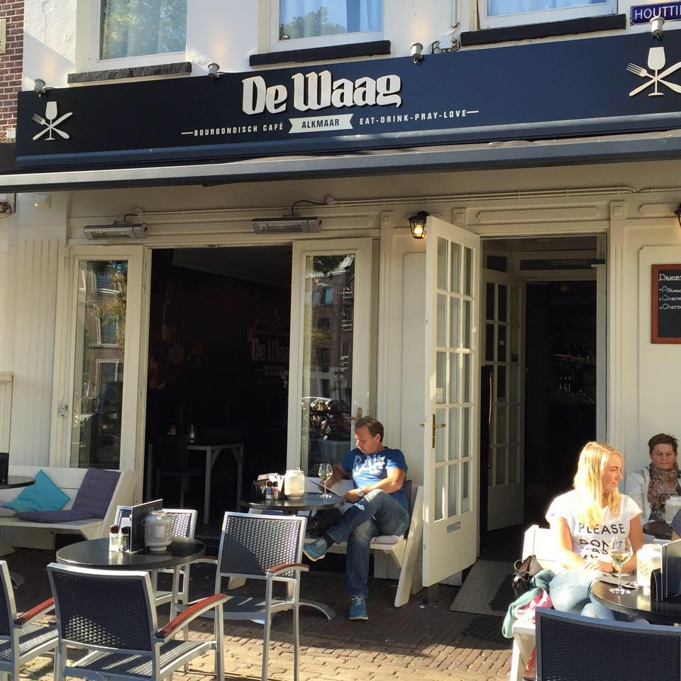
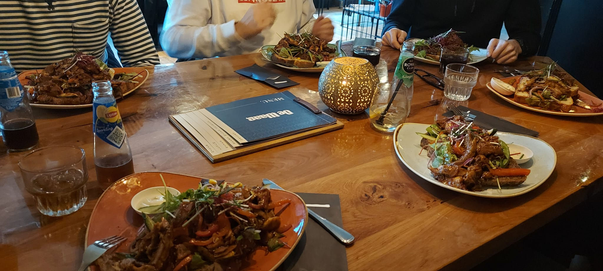
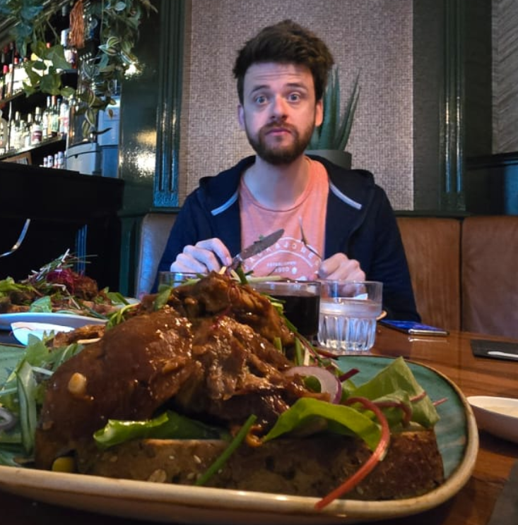

Deze keer zijn we naar [De Waag](https://www.dewaagalkmaar.nl/) geweest. Een mooi restaurantje in Alkmaar, en bekend om hun _**beste broodje spare-ribs van Europa!**_

<!-- truncate -->

We hadden allemaal de _Spare-ribs_ besteld. Het eten kwam vrij snel, en was heerlijk.
Tafeltje was ook prima. Lekker bankie, mooi hoekje, en genoeg ruimte voor iedereen.

Al met al een goede ervaring, en zeker een aanrader voor als je in de stad bent.

## ✨ De Rit ✨

We hebben een nieuw segment in de blog: _De Rit_! Hierin bespreken we hoe de rit was naar het restaurant.
Ik verwacht dat dit het favoriete segment wordt van de lezers!

De rit zelf was prima, ondanks dat Marthijn een scheetje liet.
Maar we moesten parkeren in de karperton, en als je de karperton kent, weet je dat het een vreselijke plek is om te parkeren.
Er is zelfs een [liedje](https://www.youtube.com/watch?v=3KAvKZXTXVg) over geschreven door _Krappe Sokken_. Een echte banger.

## Cijfers

We missen nogsteeds een paar cijfers.
Ik weet dat het jullie 1 na favoriete segment is,
dus hier zijn de cijfers die we tot nu toe hebben:

| Persoon  | Cijfer |
|----------|--------|
| Madelief | -      |
| Marthijn | 6,5    |
| Desiree  | -      |
| Bas      | -      |
| Wouter   | -      |
| Jordy    | 9,1    |
|**Totaal**|**9,1** |

## Locatie

<iframe src="https://www.google.com/maps/embed?pb=!1m18!1m12!1m3!1d2421.55212695893!2d4.747626077021011!3d52.63193722793563!2m3!1f0!2f0!3f0!3m2!1i1024!2i768!4f13.1!3m3!1m2!1s0x47cf57b4529f5483%3A0x64f78ef37ae18d32!2sDe%20Waag%2C%20Alkmaar!5e0!3m2!1snl!2snl!4v1734640505003!5m2!1snl!2snl" width="600" height="450" allowfullscreen="" loading="lazy" referrerpolicy="no-referrer-when-downgrade"></iframe>
