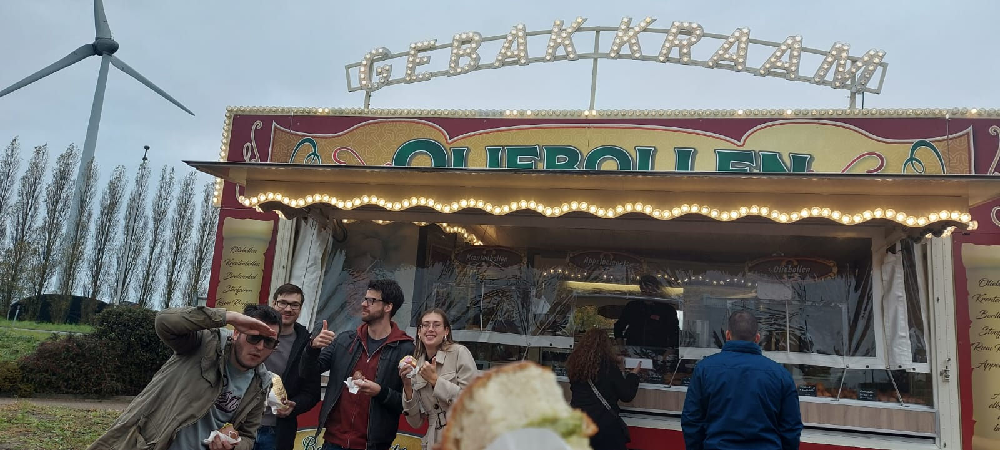

Yeahh! Vandaag gingen we naar de Intratuin in Heerhugowaard, waar een [oliebollenkraam](https://oliebollenkraamheerhugowaard.nl/) stond met, dit is niet eens een grap dit keer, de _**beste oliebollen van Noord-Holland!**_

<!-- truncate -->

Deze gasten zijn de pro's van de oliebollen. Ze zijn op het moment van schrijven al 7 jaar bekroond met goud, en 2 jaar de winnaar van de hele officiële mannetjes van [oliebollentestonline.nl](https://www.oliebollentestonline.nl/). Ze hebben allemaal verschillende smaken en rare gedrochtjes, maar ik ging voor de klassieke poedersuiker oliebol.

Eigelijk was ik vrij vandaag, maar speciaal voor deze oliebollen ben ik even langsgekomen.
Maar ik hoor je denken: Jordy, oliebollen is toch geen lunch?

Was wel lekker. 10/10 zou weer schransen.

## De Rit

Voor mij was de rit prima, aangezien ik zelf reed.
Maar ik hoorde van de andere dat er een spin in de auto zat waardoor er volledige paniek uitbarste.

## Cijfers

Het spijt me lezer, maar we zijn helaas vergeten om een cijfer te geven.
De hele essence van deze blog was om cijfers te geven aan restaurants, maar we hebben u gefaald.

Maar het goeie nieuws is, mijn cijfer is nu het eindresultaat.

| Persoon  | Cijfer |
|----------|--------|
| Madelief | -      |
| Marthijn | -      |
| Desiree  | -      |
| Bas      | -      |
| Jordy    | 10     |
|**Totaal**|**10**  |

## Locatie

:::warning

Ze zijn alleen rond de feestdagen aanwezig

:::

<iframe src="https://www.google.com/maps/embed?pb=!1m18!1m12!1m3!1d2420.923620949906!2d4.7911340776276585!3d52.64329292709273!2m3!1f0!2f0!3f0!3m2!1i1024!2i768!4f13.1!3m3!1m2!1s0x47cf5664aa497aa7%3A0xd18b73265b91e41c!2sIntratuin%20Heerhugowaard%20B.V.!5e0!3m2!1snl!2snl!4v1734561926160!5m2!1snl!2snl" width="600" height="450" allowfullscreen="" loading="lazy" referrerpolicy="no-referrer-when-downgrade"></iframe>
