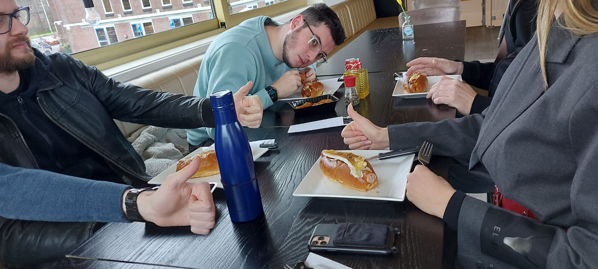

We gingen weer eens naar [Andy's lunchroom](https://www.andyslunchroom.nl/).
Voor als je de [eerste blogpost van Andy's](/andys) niet heb gelezen,
dit is de snackbar waar ik verbaal werd aangevallen door meneer Andy zelf.
Ik weet nog steeds niet waarom we telkens terug blijven komen naar deze goddeloze tent, maar het eten is wel lekker.

<!-- truncate -->

Dit keer ging ik terug naar de klassieker, de *Chicago Dog*. Uiteraard keek Andy me weer raar aan toen ik vroeg zonder saus,
maar ondertussen ben ik het gewend van hem. De hotdog was weer heerlijk, en dit keer waren de tafels niet zo plakkerig als normaal.

## De Rit

De rit was weer levensgevaarlijk. We gingen met 2 auto's,
de ene auto zat telkens te toeteren en te bumperkleven,
en de andere auto reed als een slak.
En nu durft Niels nooit meer met ons mee te rijden, wat ik wel begrijp.
Hoop alleen dat mijn ouders dit niet lezen.

## Locatie

<iframe src="https://www.google.com/maps/embed?pb=!1m18!1m12!1m3!1d2415.013394132842!2d4.760620061046338!3d52.643738891529686!2m3!1f0!2f0!3f0!3m2!1i1024!2i768!4f13.1!3m3!1m2!1s0x47cf56515f56bf93%3A0xfa19c20dc6e7dfa2!2sAndy&#39;s%20Cafetaria!5e0!3m2!1snl!2snl!4v1727825716971!5m2!1snl!2snl" width="600" height="450" allowfullscreen="" loading="lazy" referrerpolicy="no-referrer-when-downgrade"></iframe>
