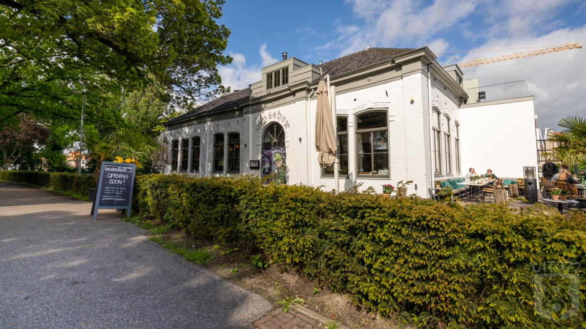
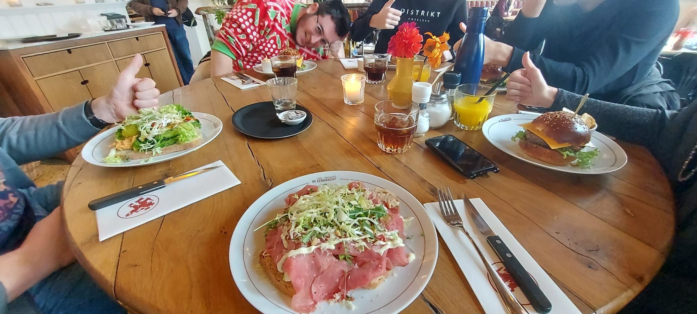

Dit keer gingen we lunchen bij [De Eendracht](https://www.deeendracht-alkmaar.nl/). Het restaurant wat ik altijd dacht de "eend-racht" heete, maar blijkbaar de "een-dracht" heet. Anyways, een restaurant aan het water in de stad van Alkmaar, en bekend om hun beste _**"Hamburger aan het water in Alkmaar" van Europa!**_

<!-- truncate -->

Het personeel was vriendelijk, maar niet heel snel. Uiteindelijk hadden we zelf maar wat menukaarten gepakt.

Ik had de _Eendracht Burger_ besteld. Een heerlijke burger met cheddar, sla, tomaat en ui met wat chips erbij.
Het duurde effe voordat we ons eten kregen, waarschijnlijk was Menno nog aan het slapen ofzo.

Toen we het eten kregen was het wel lekker. De kaas kon wel beter gesmolten zijn.
Maar de burger was goed, en de frietjes die we erbij hadden besteld waren lekker knapperig.
Bas deed er nog wat extra zout op om zijn nieren te trainen.

Tijdens het betalen werden we nog wel guilt-tripped om een euro te doneren voor oude vrouwtjes ofzo, maar ja, het is voor een goed doel zeggen ze dan.

## De Rit

Rit was prima. Beetje krap met ze 5e in de auto, maar we hebben het overleefd.
We kregen wel wat valse informatie over de parkeerplek, maar gelukkig was er een plekje om de hoek.

## Cijfers

| Persoon  | Cijfer |
|----------|--------|
| Madelief | 7,0    |
| Marthijn | 8,5    |
| Desiree  | 7,4    |
| Bas      | 6,9    |
| Jordy    | 7,6    |
|**Totaal**|**7,5** |

## Locatie

<iframe src="https://www.google.com/maps/embed?pb=!1m18!1m12!1m3!1d2421.634952459725!2d4.75375817702093!3d52.63044062804662!2m3!1f0!2f0!3f0!3m2!1i1024!2i768!4f13.1!3m3!1m2!1s0x47cf564adcd3c11d%3A0xf452a547c8eb0654!2sDe%20Eendracht%20Alkmaar%20in%20%C2%B4t%20IJkgebouw!5e0!3m2!1snl!2snl!4v1734551846115!5m2!1snl!2snl" width="600" height="450" allowfullscreen="" loading="lazy" referrerpolicy="no-referrer-when-downgrade"></iframe>
